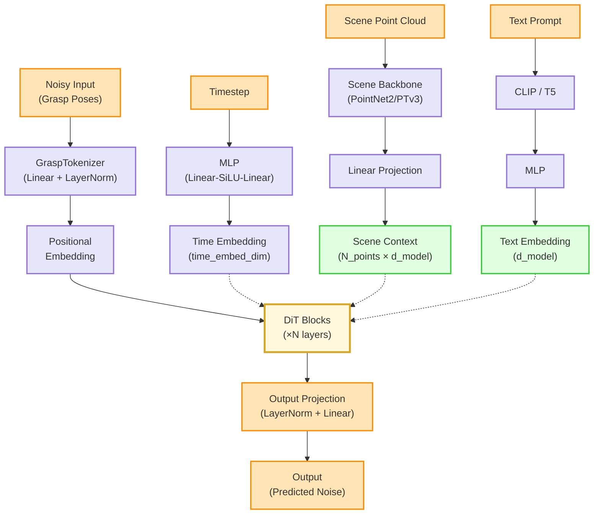
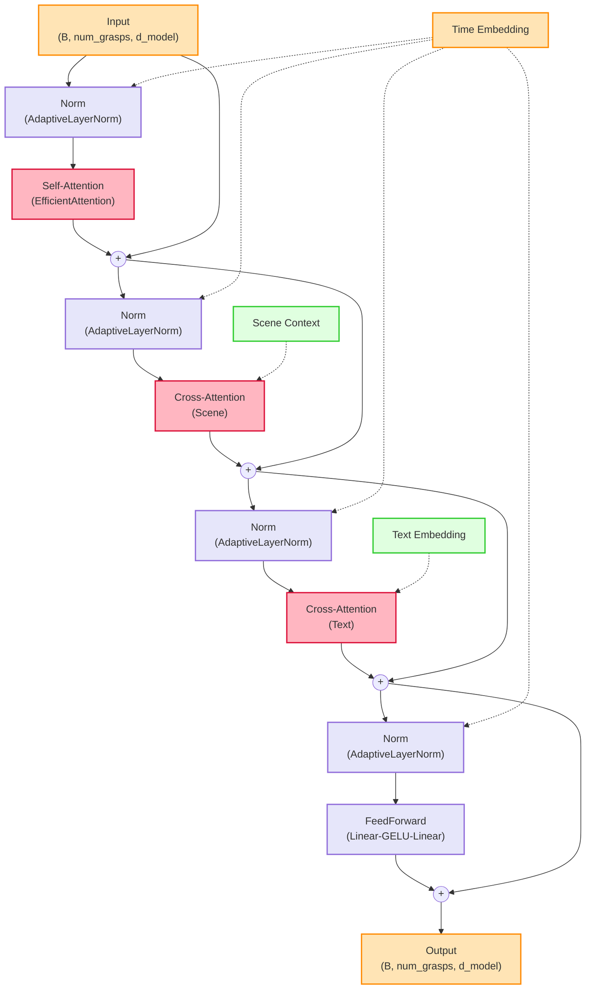

# DiT 模型架构文档

本文档描述了 SceneLeapUltra 项目中 DiT (Diffusion Transformer) 模型的详细架构。

## 整体架构



## DiT Block 详细结构



## 架构组件说明

### 1. 输入处理

#### GraspTokenizer
- **输入维度**: `(B, num_grasps, d_x)` 或 `(B, d_x)`
- **输出维度**: `(B, num_grasps, d_model)`
- **组件**:
  - Linear Projection: `d_x → d_model`
  - LayerNorm

#### 位置编码 (PositionalEmbedding)
- **类型**: 可学习的位置嵌入
- **最大长度**: 1000
- **维度**: `(max_len, d_model)`

### 2. 条件编码

#### 时间步嵌入 (TimestepEmbedding)
- **输入**: `(B,)` 时间步标量
- **输出**: `(B, time_embed_dim)`
- **网络结构**:
  ```
  Sinusoidal Embedding (d_model)
  → Linear(d_model, time_embed_dim)
  → SiLU
  → Linear(time_embed_dim, time_embed_dim)
  ```

#### 场景条件 (Scene Context)
- **输入**: 点云 `(B, N_points, 3/6/7)`
  - 基础: XYZ (3)
  - 可选: RGB (3)
  - 可选: Object Mask (1)
- **主干网络**: PointNet2 或 PTv3
- **输出维度**: `(B, N_points, d_model)`

#### 文本条件 (Text Embedding)
- **编码器**: CLIP 或 T5
- **处理流程**:
  - 文本编码: Prompt → CLIP/T5 → 512维特征
  - MLP处理: 512维 → d_model
  - 支持负面提示 (Negative Prompts)
- **文本dropout**: 训练时可配置

### 3. DiT Block

每个 DiT Block 包含四个主要组件，均采用残差连接：

#### a. Self-Attention
- **作用**: 抓取姿态之间的自注意力
- **输入/输出**: `(B, num_grasps, d_model)`
- **实现**: EfficientAttention (支持内存优化)

#### b. Scene Cross-Attention
- **作用**: 与场景特征的交叉注意力
- **Query**: 抓取特征
- **Key/Value**: 场景特征
- **维度**: `(B, num_grasps, d_model)` × `(B, N_points, d_model)`

#### c. Text Cross-Attention (可选)
- **作用**: 与文本特征的交叉注意力
- **Query**: 抓取特征
- **Key/Value**: 文本特征
- **维度**: `(B, num_grasps, d_model)` × `(B, 1, d_model)`

#### d. Feed-Forward Network
- **结构**:
  ```
  Linear(d_model, 4×d_model)
  → GELU
  → Dropout
  → Linear(4×d_model, d_model)
  → Dropout
  ```

#### AdaptiveLayerNorm
- **功能**: 条件归一化，基于时间步嵌入
- **机制**:
  ```python
  x_norm = LayerNorm(x)
  scale, shift = Linear(time_emb) → split
  output = x_norm * (1 + scale) + shift
  ```

### 4. 输出投影 (OutputProjection)
- **输入**: `(B, num_grasps, d_model)`
- **输出**: `(B, num_grasps, d_x)`
- **结构**:
  ```
  LayerNorm
  → Linear(d_model, d_x)
  ```

## 内存优化特性

### 1. EfficientAttention
- 分块计算注意力
- 可选 Flash Attention
- 可配置 chunk size

### 2. 梯度检查点 (Gradient Checkpointing)
- 逐层梯度检查点
- 显著降低训练内存占用
- 略微增加计算时间

### 3. 批处理优化
- 支持可变长度序列
- 动态批处理大小调整
- 内存监控和警告

## 配置参数

### 核心参数
| 参数 | 默认值 | 说明 |
|------|--------|------|
| `d_model` | 512 | 模型隐藏维度 |
| `num_layers` | 12 | DiT Block 层数 |
| `num_heads` | 8 | 注意力头数 |
| `d_head` | 64 | 每个注意力头的维度 |
| `time_embed_dim` | 512 | 时间步嵌入维度 |
| `dropout` | 0.1 | Dropout 比率 |

### 条件参数
| 参数 | 默认值 | 说明 |
|------|--------|------|
| `use_text_condition` | True | 是否使用文本条件 |
| `text_dropout_prob` | 0.1 | 文本条件 dropout |
| `use_negative_prompts` | True | 是否支持负面提示 |
| `use_rgb` | True | 是否使用 RGB 特征 |
| `use_object_mask` | False | 是否使用物体掩码 |

### 内存优化参数
| 参数 | 默认值 | 说明 |
|------|--------|------|
| `gradient_checkpointing` | False | 梯度检查点 |
| `use_flash_attention` | False | Flash Attention |
| `attention_chunk_size` | 512 | 注意力块大小 |
| `memory_monitoring` | True | 内存监控 |

## 与 Hunyuan-DiT 的对比

### 相似之处
1. ✅ 使用 AdaptiveLayerNorm 注入时间步信息
2. ✅ 多重交叉注意力机制
3. ✅ 残差连接设计
4. ✅ Transformer 架构

### 差异
1. 🎯 **任务定位**: Hunyuan-DiT 用于图像生成，本模型用于抓取姿态生成
2. 🎯 **输入格式**: 
   - Hunyuan: 图像 patches
   - 本模型: 抓取姿态 + 点云场景
3. 🎯 **条件机制**:
   - Hunyuan: 主要文本条件
   - 本模型: 场景点云 + 文本双重条件
4. 🎯 **序列长度**: 本模型支持可变长度抓取序列

## 使用示例

### 前向传播
```python
# 输入
x_t = torch.randn(B, num_grasps, d_x)  # 噪声抓取姿态
ts = torch.randint(0, 1000, (B,))       # 时间步
data = {
    'scene_pc': torch.randn(B, N, 6),   # 场景点云
    'positive_prompt': ["grasp the cup", ...],  # 文本提示
}

# 条件编码
condition = model.condition(data)
data.update(condition)

# 前向传播
noise_pred = model(x_t, ts, data)
```

### 推理模式
```python
model.eval()
model.optimize_for_inference()  # 应用推理优化
```

### 训练模式
```python
model.train()
model.optimize_for_training()  # 应用训练优化
```

## 文件位置

- **主模型**: `/models/decoder/dit.py`
- **配置验证**: `/models/decoder/dit_config_validation.py`
- **输入验证**: `/models/decoder/dit_validation.py`
- **内存优化**: `/models/decoder/dit_memory_optimization.py`

