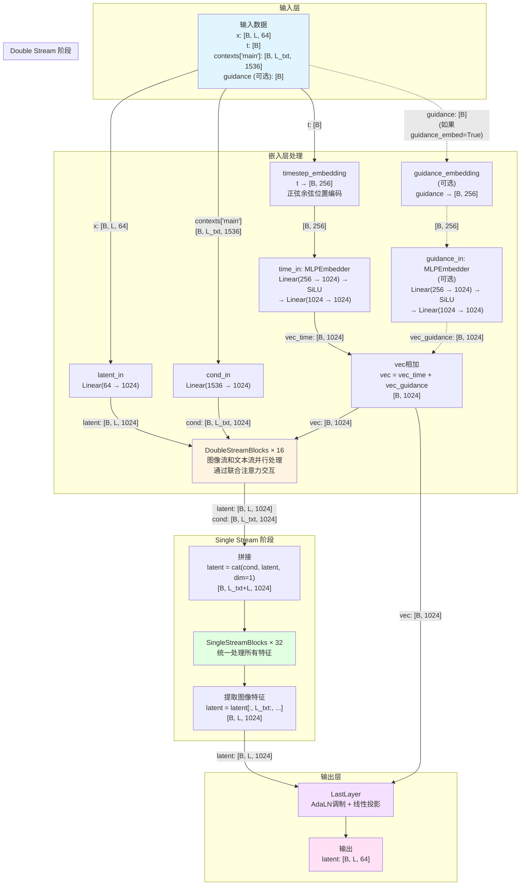

# Hunyuan3DDiT 模型架构详解

本文档详细分析 `bin/hunyuan3ddit.py` 中实现的 Hunyuan3DDiT 模型的架构、数据流变化和各个模块的工作原理。

## 目录

- [1. 模型总览](#1-模型总览)
- [2. 完整数据流程图](#2-完整数据流程图)
- [3. DoubleStreamBlock 详解](#3-doublestreamblock-详解)
- [4. SingleStreamBlock 详解](#4-singlestreamblock-详解)
- [5. Attention 机制详解](#5-attention-机制详解)
- [6. 与 EfficientAttention 的对比](#6-与-efficientattention-的对比)

---

## 1. 模型总览

### 1.1 基本信息

**Hunyuan3DDiT** 是基于 Diffusion Transformer (DiT) 架构的3D扩散模型，主要特点：

- **架构类型**: DiT (Diffusion Transformer)
- **深度**: 16层双流块 + 32层单流块
- **隐藏维度**: 1024
- **注意力头数**: 16
- **头维度**: 64 (1024/16)
- **调制方式**: AdaLN-Zero

### 1.2 模型参数

```python
Hunyuan3DDiT(
    in_channels=64,           # 输入潜在表示通道数
    context_in_dim=1536,      # 文本条件维度
    hidden_size=1024,         # 隐藏层维度
    mlp_ratio=4.0,           # MLP扩展比例
    num_heads=16,            # 注意力头数
    depth=16,                # DoubleStreamBlock层数
    depth_single_blocks=32,  # SingleStreamBlock层数
    axes_dim=[64],           # 位置编码维度
    theta=10_000,            # 位置编码频率基数
    qkv_bias=True,           # QKV投影是否使用偏置
    time_factor=1000,        # 时间步嵌入缩放因子
    guidance_embed=False,    # 是否使用guidance嵌入
)
```

### 1.3 关键组件

| 组件 | 功能 | 输入 → 输出 |
|------|------|-----------|
| `latent_in` | 潜在表示投影 | `[B, L, 64]` → `[B, L, 1024]` |
| `time_in` | 时间步嵌入 | `[B, 256]` → `[B, 1024]` |
| `cond_in` | 文本条件投影 | `[B, L_txt, 1536]` → `[B, L_txt, 1024]` |
| `guidance_in` | Guidance嵌入（可选） | `[B, 256]` → `[B, 1024]` |
| `double_blocks` | 双流处理块 × 16 | 图像流 + 文本流并行处理 |
| `single_blocks` | 单流处理块 × 32 | 合并后的统一处理 |
| `final_layer` | 输出层 | `[B, L, 1024]` → `[B, L, 64]` |

---

## 2. 完整数据流程图

### 2.1 总体架构流程图



### 2.2 数据维度变化总结

| 阶段 | 输入维度 | 输出维度 | 说明 |
|------|---------|---------|------|
| **输入** | `x: [B, L, 64]` | - | 原始潜在表示 |
| **嵌入层** | `x: [B, L, 64]` | `latent: [B, L, 1024]` | 投影到隐藏维度 |
| | `t: [B]` | `vec: [B, 1024]` | 时间步嵌入 |
| | `contexts: [B, L_txt, 1536]` | `cond: [B, L_txt, 1024]` | 文本条件投影 |
| **DoubleStream** | `img: [B, L, 1024]`<br/>`txt: [B, L_txt, 1024]` | `img: [B, L, 1024]`<br/>`txt: [B, L_txt, 1024]` | 双流并行处理 × 16层 |
| **拼接** | 两个独立流 | `[B, L_txt+L, 1024]` | 合并文本和图像 |
| **SingleStream** | `[B, L_txt+L, 1024]` | `[B, L_txt+L, 1024]` | 单流处理 × 32层 |
| **提取** | `[B, L_txt+L, 1024]` | `[B, L, 1024]` | 只保留图像部分 |
| **输出层** | `[B, L, 1024]` | `[B, L, 64]` | 投影回原始维度 |

---

## 3. DoubleStreamBlock 详解

### 3.1 整体架构

DoubleStreamBlock 是**双流处理**模块，同时处理图像特征流和文本特征流，并通过**联合注意力**实现跨模态交互。

**初始化参数**:
```python
DoubleStreamBlock(
    hidden_size=1024,      # 隐藏层维度
    num_heads=16,          # 注意力头数
    mlp_ratio=4.0,         # MLP扩展比例 → mlp_hidden_dim=4096
    qkv_bias=False         # QKV投影是否使用偏置
)
```

**输入数据**:
- `img`: `[B, L, 1024]` - 图像潜在特征
- `txt`: `[B, L_txt, 1024]` - 文本条件特征  
- `vec`: `[B, 1024]` - 时间步嵌入
- `pe`: Position Embedding（代码中为None）

### 3.2 详细数据流程

#### 阶段1: Modulation（自适应调制）

```python
img_mod1, img_mod2 = self.img_mod(vec)  
txt_mod1, txt_mod2 = self.txt_mod(vec)
```

**Image Modulation 过程**:
```
输入: vec [B, 1024]
  ↓
SiLU激活
  ↓  
Linear(1024 → 6144)
  ↓
[:, None, :] 扩展维度 → [B, 1, 6144]
  ↓
chunk(6, dim=-1) 分成6份
  ↓
输出: img_mod1 (shift, scale, gate)  [B, 1, 1024] × 3
      img_mod2 (shift, scale, gate)  [B, 1, 1024] × 3
```

Text Modulation 同样的处理。

**作用**: 使用时间步信息生成调制参数，控制归一化层的scale和shift，以及最终输出的gate。

#### 阶段2: Image流 - 注意力准备

**2.1 归一化与调制**:
```python
img_modulated = self.img_norm1(img)
img_modulated = (1 + img_mod1.scale) * img_modulated + img_mod1.shift
```

```
img: [B, L, 1024]
  ↓
LayerNorm (无仿射参数)
  ↓ [B, L, 1024]
调制: (1 + scale[B,1,1024]) * norm + shift[B,1,1024]
  ↓
img_modulated: [B, L, 1024]
```

**2.2 QKV投影**:
```python
img_qkv = self.img_attn.qkv(img_modulated)
img_q, img_k, img_v = rearrange(img_qkv, "B L (K H D) -> K B H L D", K=3, H=16)
```

```
img_modulated: [B, L, 1024]
  ↓
Linear(1024 → 3072)  # 3 * 1024
  ↓
img_qkv: [B, L, 3072]
  ↓
rearrange 重排列
  ↓
[3, B, 16, L, 64]
  ↓
分解为3个张量:
img_q: [B, 16, L, 64]  # Query
img_k: [B, 16, L, 64]  # Key  
img_v: [B, 16, L, 64]  # Value
```

**2.3 QK归一化**:
```python
img_q, img_k = self.img_attn.norm(img_q, img_k, img_v)
```

使用 **RMSNorm** 在最后一维（dim=64）归一化：
```
rrms = rsqrt(mean(q^2, dim=-1, keepdim=True) + 1e-6)
normalized = q * rrms * learnable_scale
```

**作用**: 稳定训练，防止注意力分数过大。

#### 阶段3: Text流 - 注意力准备

```python
txt_modulated = self.txt_norm1(txt)
txt_modulated = (1 + txt_mod1.scale) * txt_modulated + txt_mod1.shift
txt_qkv = self.txt_attn.qkv(txt_modulated)
txt_q, txt_k, txt_v = rearrange(txt_qkv, "B L (K H D) -> K B H L D", K=3, H=16)
txt_q, txt_k = self.txt_attn.norm(txt_q, txt_k, txt_v)
```

与Image流完全相同的处理流程：
```
txt: [B, L_txt, 1024]
  → 归一化调制 → [B, L_txt, 1024]
  → QKV投影 → [B, L_txt, 3072]
  → 重排列 → txt_q, txt_k, txt_v: [B, 16, L_txt, 64]
  → QK归一化 → txt_q, txt_k: [B, 16, L_txt, 64]
```

#### 阶段4: 联合注意力（核心交互机制）

```python
q = torch.cat((txt_q, img_q), dim=2)
k = torch.cat((txt_k, img_k), dim=2)
v = torch.cat((txt_v, img_v), dim=2)

attn = attention(q, k, v, pe=pe)
txt_attn, img_attn = attn[:, :txt.shape[1]], attn[:, txt.shape[1]:]
```

**4.1 拼接QKV**:
```
txt_q: [B, 16, L_txt, 64]
img_q: [B, 16, L,     64]
  ↓ cat(dim=2)
q: [B, 16, L_txt+L, 64]

同理:
k: [B, 16, L_txt+L, 64]
v: [B, 16, L_txt+L, 64]
```

**4.2 注意力计算**:
```
q, k, v: [B, 16, L_txt+L, 64]
  ↓
scaled_dot_product_attention
  scores = softmax(q @ k^T / sqrt(64))
  output = scores @ v
  ↓
[B, 16, L_txt+L, 64]
  ↓
rearrange "B H L D -> B L (H D)"
  ↓
attn: [B, L_txt+L, 1024]
```

**关键点**: 
- **文本token可以attend到所有图像token**
- **图像token可以attend到所有文本token**
- 这实现了跨模态的信息交互！

**注意力矩阵可视化**:
```
              txt_1  txt_2  ... txt_Ltxt | img_1  img_2  ... img_L
         +----------------------------------------------------+
    txt_1|    0.3    0.2   ...   0.1    |  0.05   0.05  ... 0.05  |
    txt_2|    0.2    0.35  ...   0.15   |  0.03   0.04  ... 0.03  |
      ...|    ...    ...   ...   ...    |  ...    ...   ... ...   |
txt_Ltxt |    0.1    0.15  ...   0.4    |  0.02   0.03  ... 0.02  |
         +----------------------------------------------------+
    img_1|    0.1    0.08  ...   0.05   |  0.3    0.15  ... 0.1   |
    img_2|    0.08   0.12  ...   0.04   |  0.2    0.35  ... 0.08  |
      ...|    ...    ...   ...   ...    |  ...    ...   ... ...   |
    img_L|    0.05   0.06  ...   0.03   |  0.15   0.1   ... 0.4   |
         +----------------------------------------------------+
```

**4.3 分割注意力输出**:
```python
txt_attn = attn[:, :txt.shape[1]]       # [B, L_txt, 1024]
img_attn = attn[:, txt.shape[1]:]       # [B, L, 1024]
```

#### 阶段5: Image流 - 第一次残差更新

```python
img = img + img_mod1.gate * self.img_attn.proj(img_attn)
```

```
img_attn: [B, L, 1024]
  ↓
img_attn.proj: Linear(1024 → 1024)
  ↓ [B, L, 1024]
乘以门控: img_mod1.gate [B, 1, 1024] (广播)
  ↓ [B, L, 1024]
残差连接: img = img + gated_output
  ↓
img: [B, L, 1024] (更新后)
```

**作用**: 
- `gate`控制注意力输出对原始特征的影响程度
- AdaLN-Zero初始化gate接近0，让模型从恒等映射开始学习

#### 阶段6: Image流 - MLP处理

```python
img = img + img_mod2.gate * self.img_mlp(
    (1 + img_mod2.scale) * self.img_norm2(img) + img_mod2.shift
)
```

**6.1 归一化与调制**:
```
img: [B, L, 1024]
  ↓
LayerNorm (无仿射参数)
  ↓ [B, L, 1024]
调制: (1 + img_mod2.scale) * norm + img_mod2.shift
  ↓ [B, L, 1024]
```

**6.2 MLP前馈网络**:
```python
self.img_mlp = nn.Sequential(
    nn.Linear(1024, 4096),    # 扩展
    GELU(approximate="tanh"),  # 激活
    nn.Linear(4096, 1024),    # 压缩
)
```

```
调制后: [B, L, 1024]
  ↓
Linear(1024 → 4096)
  ↓ [B, L, 4096]
GELU激活
  ↓ [B, L, 4096]
Linear(4096 → 1024)
  ↓ [B, L, 1024]
```

**6.3 门控与残差**:
```
mlp输出: [B, L, 1024]
  ↓
乘以门控: img_mod2.gate [B, 1, 1024]
  ↓
残差连接: img = img + gated_mlp_output
  ↓
img: [B, L, 1024] (最终输出)
```

#### 阶段7: Text流 - 残差更新

```python
txt = txt + txt_mod1.gate * self.txt_attn.proj(txt_attn)
txt = txt + txt_mod2.gate * self.txt_mlp(
    (1 + txt_mod2.scale) * self.txt_norm2(txt) + txt_mod2.shift
)
```

处理流程与Image流完全一致。

### 3.3 完整数据流总结

```
输入:
  img: [B, L, 1024]
  txt: [B, L_txt, 1024]
  vec: [B, 1024]

Modulation生成:
  img_mod1, img_mod2: 各3个[B,1,1024] (shift,scale,gate)
  txt_mod1, txt_mod2: 各3个[B,1,1024]

Image分支准备:
  img → norm → modulate → qkv → [B,16,L,64] × 3 → qk_norm

Text分支准备:
  txt → norm → modulate → qkv → [B,16,L_txt,64] × 3 → qk_norm

联合注意力:
  cat(txt_qkv, img_qkv) → [B,16,L_txt+L,64]
  → attention → [B,L_txt+L,1024]
  → split → txt_attn[B,L_txt,1024], img_attn[B,L,1024]

Image更新:
  img = img + gate1 * proj(img_attn)  # 注意力残差
  img = img + gate2 * mlp(...)         # MLP残差

Text更新:
  txt = txt + gate1 * proj(txt_attn)  # 注意力残差
  txt = txt + gate2 * mlp(...)         # MLP残差

输出:
  img: [B, L, 1024]
  txt: [B, L_txt, 1024]
```

### 3.4 关键设计特点

#### 1. 双流架构的优势
- 图像和文本保持独立的处理路径
- 通过联合注意力实现跨模态交互
- 各自的MLP保持模态特定的特征处理

#### 2. AdaLN-Zero调制
- 使用时间步信息动态调整归一化
- `shift`和`scale`改变特征分布
- `gate`控制新信息的融合程度
- 初始化策略让模型从恒等映射开始

#### 3. QK归一化
- RMSNorm稳定注意力计算
- 防止大值导致的梯度问题
- 对长序列特别重要

#### 4. 联合注意力机制
文本和图像token在同一个attention中计算，每个token都可以attend到所有其他token（文本+图像）！

---

## 4. SingleStreamBlock 详解

### 4.1 整体架构

SingleStreamBlock 是**单流处理**模块，与 DoubleStreamBlock 不同，它将所有特征（文本+图像）作为一个统一的序列处理。采用**并行架构**，QKV投影和MLP在同一个线性层中并行计算，提高效率。

**初始化参数**:
```python
SingleStreamBlock(
    hidden_size=1024,      # 隐藏层维度
    num_heads=16,          # 注意力头数
    mlp_ratio=4.0,         # MLP扩展比例 → mlp_hidden_dim=4096
    qk_scale=None          # 注意力缩放因子（默认head_dim^-0.5=0.125）
)
```

**关键组件**:
```python
# 并行线性层：同时计算QKV和MLP输入
self.linear1 = nn.Linear(1024, 1024*3 + 4096)  # → 7168

# 并行输出层：同时处理注意力输出和MLP输出
self.linear2 = nn.Linear(1024 + 4096, 1024)    # 5120 → 1024

self.norm = QKNorm(head_dim=64)
self.pre_norm = LayerNorm(1024, elementwise_affine=False)
self.mlp_act = GELU(approximate="tanh")
self.modulation = Modulation(1024, double=False)  # 只有一组调制参数
```

**输入数据**:
- `x`: `[B, L_txt+L, 1024]` - 合并后的文本+图像特征序列
- `vec`: `[B, 1024]` - 时间步嵌入
- `pe`: Position Embedding（代码中为None）

### 4.2 详细数据流程

#### 阶段1: Modulation（自适应调制）

```python
mod, _ = self.modulation(vec)
```

```
输入: vec [B, 1024]
  ↓
SiLU激活
  ↓
Linear(1024 → 3072)  # multiplier=3 (因为double=False)
  ↓
[:, None, :] 扩展维度 → [B, 1, 3072]
  ↓
chunk(3, dim=-1) 分成3份
  ↓
输出: mod (shift, scale, gate)  [B, 1, 1024] × 3
第二个返回值为None（因为double=False）
```

**作用**: 生成单组调制参数，控制整个block的归一化和输出门控。

#### 阶段2: 归一化与调制

```python
x_mod = (1 + mod.scale) * self.pre_norm(x) + mod.shift
```

```
x: [B, L_txt+L, 1024]
  ↓
pre_norm: LayerNorm(无仿射参数)
  计算: normalized = (x - mean) / sqrt(var + eps)
  ↓ [B, L_txt+L, 1024]
调制:
  (1 + mod.scale[B,1,1024]) * normalized + mod.shift[B,1,1024]
  广播机制: [B,1,1024] → [B,L_txt+L,1024]
  ↓
x_mod: [B, L_txt+L, 1024]
```

#### 阶段3: 并行线性投影（关键设计！）

```python
qkv, mlp = torch.split(
    self.linear1(x_mod), 
    [3 * self.hidden_size, self.mlp_hidden_dim], 
    dim=-1
)
```

**单个线性层同时计算**:
```
x_mod: [B, L_txt+L, 1024]
  ↓
linear1: Linear(1024 → 7168)
  权重矩阵: [1024, 7168]
  分为两部分:
    - QKV部分: [1024, 3072]  (前3*1024维)
    - MLP部分: [1024, 4096]  (后4096维)
  ↓
output: [B, L_txt+L, 7168]
  ↓
torch.split([3072, 4096], dim=-1)
  ↓
qkv: [B, L_txt+L, 3072]
mlp: [B, L_txt+L, 4096]
```

**优势**: 
- **并行计算**: 一次矩阵乘法同时得到QKV和MLP的输入
- **内存效率**: 减少内存访问次数
- **计算效率**: 利用GPU并行性，比两次线性层更快

#### 阶段4: 注意力分支处理

**4.1 QKV重排列**:
```python
q, k, v = rearrange(qkv, "B L (K H D) -> K B H L D", K=3, H=16)
```

```
qkv: [B, L_txt+L, 3072]
  ↓
reshape理解:
  3072 = K * H * D = 3 * 16 * 64
  ↓
rearrange: [B, L_txt+L, 3, 16, 64] → [3, B, 16, L_txt+L, 64]
  ↓
分解为3个张量:
q: [B, 16, L_txt+L, 64]  # Query
k: [B, 16, L_txt+L, 64]  # Key
v: [B, 16, L_txt+L, 64]  # Value
```

**4.2 QK归一化**:
```python
q, k = self.norm(q, k, v)
```

使用 RMSNorm 在最后一维（dim=64）归一化。

**4.3 注意力计算**:
```python
attn = attention(q, k, v, pe=pe)
```

```
q, k, v: [B, 16, L_txt+L, 64]
  ↓
scaled_dot_product_attention
  scores = softmax(q @ k^T / sqrt(64))  # [B, 16, L_txt+L, L_txt+L]
  output = scores @ v                    # [B, 16, L_txt+L, 64]
  ↓
rearrange "B H L D -> B L (H D)"
  ↓
attn: [B, L_txt+L, 1024]
```

#### 阶段5: MLP分支处理

```python
mlp_activated = self.mlp_act(mlp)
```

```
mlp: [B, L_txt+L, 4096]
  ↓
GELU(approximate="tanh")
  ↓
mlp_activated: [B, L_txt+L, 4096]
```

#### 阶段6: 并行输出合并

```python
output = self.linear2(torch.cat((attn, mlp_activated), dim=-1))
```

```
attn: [B, L_txt+L, 1024]
mlp_activated: [B, L_txt+L, 4096]
  ↓
cat(dim=-1)
  ↓
[B, L_txt+L, 5120]
  ↓
linear2: Linear(5120 → 1024)
  ↓
output: [B, L_txt+L, 1024]
```

**关键**: 注意力和MLP的输出在这一步才合并！

#### 阶段7: 门控与残差连接

```python
return x + mod.gate * output
```

```
output: [B, L_txt+L, 1024]
  ↓
乘以门控: mod.gate [B, 1, 1024]
  ↓
gated_output: [B, L_txt+L, 1024]
  ↓
残差连接: x + gated_output
  ↓
final_output: [B, L_txt+L, 1024]
```

### 4.3 完整数据流总结

```
输入: x [B, L_txt+L, 1024], vec [B, 1024]

Modulation:
  vec → mod (shift, scale, gate) [B, 1, 1024] × 3

归一化调制:
  x → LayerNorm → modulate → x_mod [B, L_txt+L, 1024]

并行投影:
  x_mod → linear1(1024→7168) → split
    ├─ qkv [B, L_txt+L, 3072]
    └─ mlp [B, L_txt+L, 4096]

注意力分支:
  qkv → rearrange → q,k,v [B, 16, L_txt+L, 64]
      → qk_norm → attention → [B, L_txt+L, 1024]

MLP分支:
  mlp → GELU → [B, L_txt+L, 4096]

合并输出:
  cat(attn, mlp) → [B, L_txt+L, 5120]
                 → linear2 → [B, L_txt+L, 1024]

门控残差:
  x + gate * output → [B, L_txt+L, 1024]
```

### 4.4 与 DoubleStreamBlock 的对比

| 特性 | DoubleStreamBlock | SingleStreamBlock |
|------|------------------|-------------------|
| **流数量** | 双流（图像+文本分离） | 单流（合并处理） |
| **注意力范围** | 联合注意力（跨模态） | 统一注意力（所有token） |
| **调制参数** | 两组（图像和文本各自） | 一组（统一控制） |
| **MLP结构** | 串行（标准结构） | 并行（与QKV并行） |
| **计算效率** | 中等 | 高（并行设计） |
| **参数量** | 更多（两套独立参数） | 较少（共享处理） |
| **适用场景** | 需要保持模态区分 | 特征已充分融合 |

---

## 5. Attention 机制详解

### 5.1 代码结构

```python
# 可选的高效注意力实现
scaled_dot_product_attention = nn.functional.scaled_dot_product_attention
if os.environ.get('USE_SAGEATTN', '0') == '1':
    try:
        from sageattention import sageattn
        scaled_dot_product_attention = sageattn
    except ImportError:
        raise ImportError('Please install "sageattention"')


def attention(q: Tensor, k: Tensor, v: Tensor, **kwargs) -> Tensor:
    """
    轻量级注意力函数
    输入: q, k, v 都是 [B, H, L, D]
    输出: [B, L, H*D]
    """
    x = scaled_dot_product_attention(q, k, v)
    x = rearrange(x, "B H L D -> B L (H D)")
    return x
```

### 5.2 输入数据格式

```
q: [B, H, L, D]
k: [B, H, L, D]  
v: [B, H, L, D]

其中:
  B = batch_size (批次大小)
  H = num_heads (注意力头数，例如16)
  L = sequence_length (序列长度)
  D = head_dim (每个头的维度，例如64)
```

### 5.3 Scaled Dot-Product Attention 核心计算

数学公式：
$$\text{Attention}(Q, K, V) = \text{softmax}\left(\frac{QK^T}{\sqrt{d_k}}\right)V$$

#### 步骤1: 计算注意力分数

```python
scores = torch.matmul(q, k.transpose(-2, -1))  # QK^T
```

```
q: [B, H, L, D]
k: [B, H, L, D]
k.transpose(-2, -1): [B, H, D, L]
  ↓
matmul(q, k^T)
  ↓
scores: [B, H, L, L]  # 注意力分数矩阵
```

**数值示例**（简化为单头，L=3，D=2）:
```python
q = [[1.0, 0.5],    # token_1的query
     [0.8, 1.2],    # token_2的query  
     [0.3, 0.9]]    # token_3的query

k = [[1.2, 0.4],    # token_1的key
     [0.7, 1.1],    # token_2的key
     [0.5, 0.8]]    # token_3的key

scores = q @ k^T:
         k1   k2   k3
    q1 [[1.4, 1.25, 1.22],
    q2  [1.8, 1.88, 1.36],
    q3  [0.99, 1.2, 0.87]]
```

**含义**: `scores[i, j]` 表示第 i 个 token 对第 j 个 token 的**原始关注度**。

#### 步骤2: 缩放 (Scaling)

```python
scores = scores / math.sqrt(D)  # 除以sqrt(head_dim)
```

```
D = 64 (head_dim)
sqrt(D) = 8.0

scores: [B, H, L, L]
  ↓
除以 8.0
  ↓
scaled_scores: [B, H, L, L]
```

**为什么要缩放？**

假设 q 和 k 的元素是独立同分布的，均值为0，方差为1：
- `q·k` 的方差约为 `d_k`（维度）
- 当 `d_k` 很大时，点积会非常大
- 导致 softmax 进入饱和区，梯度消失

**数值对比**:
```
不缩放时 (d=64):
  scores 可能在 [-50, 50] 范围
  softmax(50) ≈ 1.0, softmax(-50) ≈ 0.0  # 梯度接近0

缩放后 (除以8):
  scores 在 [-6.25, 6.25] 范围
  梯度更健康！
```

#### 步骤3: Softmax 归一化

```python
attention_weights = torch.softmax(scaled_scores, dim=-1)
```

```
scaled_scores: [B, H, L, L]
  ↓
对最后一个维度做softmax
对于每一行: exp(x_i) / sum(exp(x_j))
  ↓
attention_weights: [B, H, L, L]
每一行的和为 1.0
```

**数学公式**:
$$\text{softmax}(x_i) = \frac{e^{x_i}}{\sum_{j=1}^{L} e^{x_j}}$$

**数值示例**:
```python
# 对第一行 [0.99, 0.88, 0.86] 做softmax:
exp_values = [2.69, 2.41, 2.36]
sum_exp = 7.46

attention_weights[0] = [0.36, 0.32, 0.32]  # 和为1.0

# 完整的attention_weights:
         k1    k2    k3
    q1 [[0.36, 0.32, 0.32],   # token_1的注意力分布
    q2  [0.31, 0.37, 0.32],   # token_2的注意力分布
    q3  [0.30, 0.37, 0.33]]   # token_3的注意力分布
```

**含义**: 
- 每一行是一个概率分布
- `attention_weights[i, j]` = token_i 分配给 token_j 的注意力权重
- 权重和为1，表示"关注度"的分配

#### 步骤4: 加权求和 (Weighted Sum)

```python
output = torch.matmul(attention_weights, v)
```

```
attention_weights: [B, H, L, L]
v: [B, H, L, D]
  ↓
matmul
  ↓
output: [B, H, L, D]
```

**数学含义**: 每个 token 的输出是所有 token 的 value 的**加权平均**。

**数值示例**:
```python
v = [[2.0, 1.5],    # token_1的value
     [1.0, 2.5],    # token_2的value
     [1.8, 0.8]]    # token_3的value

# token_1的输出 = 0.36*[2.0,1.5] + 0.32*[1.0,2.5] + 0.32*[1.8,0.8]
#              = [1.62, 1.60]

# token_2的输出 = 0.31*[2.0,1.5] + 0.37*[1.0,2.5] + 0.32*[1.8,0.8]
#              = [1.56, 1.85]

# token_3的输出 = [1.56, 1.64]

output = [[1.62, 1.60],
          [1.56, 1.85],
          [1.56, 1.64]]
```

**关键理解**: 每个 token 都融合了其他 token 的信息！

### 5.4 多头合并

```python
x = rearrange(x, "B H L D -> B L (H D)")
```

```
x: [B, H, L, D]
例如: [B, 16, L, 64]
  ↓
rearrange: 将 H 和 D 维度合并
  ↓
output: [B, L, H*D]
例如: [B, L, 1024]  (16*64=1024)
```

**详细过程示例**（B=1, H=3, L=4, D=2）:
```python
# 输入:
x[0, 0, :, :] = [[1,2], [3,4], [5,6], [7,8]]     # head_0
x[0, 1, :, :] = [[9,10], [11,12], [13,14], [15,16]]  # head_1
x[0, 2, :, :] = [[17,18], [19,20], [21,22], [23,24]] # head_2

# rearrange后，按token排列，拼接所有头:
output[0, 0, :] = [1,2, 9,10, 17,18]    # token_0 所有头拼接
output[0, 1, :] = [3,4, 11,12, 19,20]   # token_1 所有头拼接
output[0, 2, :] = [5,6, 13,14, 21,22]   # token_2 所有头拼接
output[0, 3, :] = [7,8, 15,16, 23,24]   # token_3 所有头拼接

# 形状: [B, L, H*D] = [1, 4, 6]
```

### 5.5 PyTorch 的 scaled_dot_product_attention

PyTorch 的内置函数会自动选择最优实现：

#### 1. 标准实现 (naive)
```python
scores = (q @ k.transpose(-2, -1)) / math.sqrt(q.size(-1))
attn_weights = F.softmax(scores, dim=-1)
output = attn_weights @ v
```

#### 2. Flash Attention（自动选择）
如果条件满足，会使用高效的 Flash Attention：
- 减少 HBM（高带宽内存）访问
- 分块计算，降低内存峰值
- 速度提升 2-4x

#### 3. Memory-Efficient Attention
- 不显式存储完整的注意力矩阵 `[B, H, L, L]`
- 节省内存，适合长序列

#### 4. 可选参数
```python
scaled_dot_product_attention(
    q, k, v,
    attn_mask=None,      # 注意力掩码
    dropout_p=0.0,       # Dropout概率
    is_causal=False,     # 是否使用因果掩码
)
```

### 5.6 SageAttention 高效实现

当设置 `USE_SAGEATTN=1` 时使用：

```python
from sageattention import sageattn
```

**优势**:
1. **量化加速**: 使用 INT8/FP8 量化计算
2. **内核融合**: 减少内存访问
3. **硬件优化**: 针对特定GPU优化
4. **更低内存**: 适合超长序列

**性能对比**:
```
标准实现:     100% 时间, 100% 内存
Flash Attn:   40% 时间,  50% 内存
SageAttn:     25% 时间,  40% 内存  (可能略微损失精度)
```

### 5.7 完整的注意力流程总结

```
输入:
  q: [B, H, L, D] = [2, 16, 256, 64]
  k: [B, H, L, D] = [2, 16, 256, 64]
  v: [B, H, L, D] = [2, 16, 256, 64]

步骤1: 计算分数
  scores = q @ k^T
  → [2, 16, 256, 256]

步骤2: 缩放
  scores = scores / sqrt(64) = scores / 8.0
  → [2, 16, 256, 256]

步骤3: Softmax
  attention_weights = softmax(scores, dim=-1)
  → [2, 16, 256, 256]
  每一行的和为1.0

步骤4: 加权求和
  output = attention_weights @ v
  → [2, 16, 256, 64]

步骤5: 多头合并
  output = rearrange(output, "B H L D -> B L (H D)")
  → [2, 256, 1024]

返回: [B, L, hidden_dim]
```

### 5.8 关键设计要点

#### 1. 多头注意力的意义
不同的头可以学习不同的关注模式：
- Head 1: 关注局部邻近token
- Head 2: 关注全局语义相似token
- Head 3: 关注特定类型的token

#### 2. 缩放因子的重要性
- 没有缩放: 梯度消失/爆炸
- 合适的缩放: 稳定训练

#### 3. 计算复杂度
- 时间复杂度: O(L² · d)
- 空间复杂度: O(L²) （存储注意力矩阵）
- 对长序列是瓶颈！

#### 4. 优化方向
- Flash Attention: 减少内存访问
- Sparse Attention: 只计算部分位置
- Linear Attention: 降低复杂度到 O(L)

---

## 6. 与 EfficientAttention 的对比

### 6.1 架构层级对比

#### Hunyuan3DDiT 的 `attention` 函数
```python
def attention(q: Tensor, k: Tensor, v: Tensor, **kwargs) -> Tensor:
    x = scaled_dot_product_attention(q, k, v)
    x = rearrange(x, "B H L D -> B L (H D)")
    return x
```

**特点**:
- **轻量级函数**: 不是 `nn.Module`，只是一个函数
- **不包含投影**: QKV投影在外部完成
- **极简设计**: 只做两件事：调用SDPA + 重排列维度
- **固定后端**: PyTorch SDPA 或 SageAttention

#### EfficientAttention 模块
```python
class EfficientAttention(nn.Module):
    def __init__(self, d_model, num_heads, d_head, dropout, ...):
        self.to_q = nn.Linear(d_model, self.inner_dim, bias=False)
        self.to_k = nn.Linear(d_model, self.inner_dim, bias=False)
        self.to_v = nn.Linear(d_model, self.inner_dim, bias=False)
        self.to_out = nn.Sequential(nn.Linear(...), nn.Dropout(...))
```

**特点**:
- **完整的 nn.Module**: 包含所有组件
- **集成投影层**: QKV投影和输出投影都在内部
- **多后端选择**: 4种实现可选
- **更多功能**: dropout、mask、attention_bias支持

### 6.2 功能对比表

| 功能 | Hunyuan3DDiT `attention` | EfficientAttention |
|------|-------------------------|-------------------|
| **QKV投影** | ❌ 外部处理 | ✅ 内部包含 `to_q/k/v` |
| **输出投影** | ❌ 外部处理 | ✅ 内部包含 `to_out` |
| **Dropout** | ❌ 无 | ✅ 注意力dropout + 输出dropout |
| **Mask支持** | ❌ 无 | ✅ 多种mask格式 |
| **Attention Bias** | ❌ 无 | ✅ 支持几何bias |
| **后端选择** | 2种 (SDPA/SageAttn) | 4种 (SDPA/Flash/Chunked/Standard) |
| **分块计算** | ❌ 无 | ✅ Chunked attention |
| **内存监控** | ❌ 无 | ✅ 详细日志和fallback |

### 6.3 使用方式对比

#### Hunyuan3DDiT 风格
```python
class SelfAttention(nn.Module):
    def __init__(self):
        self.qkv = nn.Linear(1024, 3072)
        self.proj = nn.Linear(1024, 1024)
    
    def forward(self, x):
        qkv = self.qkv(x)
        q, k, v = rearrange(qkv, "B L (K H D) -> K B H L D", K=3, H=16)
        x = attention(q, k, v)  # 简单调用
        x = self.proj(x)
        return x
```

**优点**: 代码简洁，控制粒度细，易于理解
**缺点**: 需要手动处理细节，没有mask/dropout支持

#### EfficientAttention 风格
```python
attn = EfficientAttention(
    d_model=1024, 
    num_heads=16, 
    d_head=64,
    dropout=0.1,
    chunk_size=512
)
output = attn(query, key, value, mask=mask)
```

**优点**: 开箱即用，功能完整，自动内存优化
**缺点**: 更重，封装层级多

### 6.4 内存优化对比

#### Hunyuan3DDiT
- ✅ 依赖PyTorch自动选择backend
- ✅ SageAttention提供量化加速
- ❌ 没有显式的内存管理
- ❌ 无长序列特殊处理

#### EfficientAttention
- ✅ 分块计算避免存储完整 `[L, L]` 矩阵
- ✅ 对长序列特别优化
- ✅ 详细的内存监控和日志
- ✅ 自动fallback机制

**内存对比**（L=4096）:
```
标准注意力: B * 16 * 4096 * 4096 * 4 bytes = B * 1GB

分块注意力 (chunk_size=512):
            B * 16 * 512 * 4096 * 4 bytes = B * 128MB
            节省8倍内存！
```

### 6.5 性能和适用场景

#### Hunyuan3DDiT `attention`

**适用场景**:
- ✅ 固定长度序列（<2048）
- ✅ 不需要mask的self-attention
- ✅ 追求极致简洁
- ✅ DiT/Flux类架构

**性能**:
- 序列长度 256:   极快
- 序列长度 1024:  快
- 序列长度 4096:  可能OOM

#### EfficientAttention

**适用场景**:
- ✅ 变长序列
- ✅ 需要padding mask
- ✅ 超长序列（>2048）
- ✅ 需要attention bias
- ✅ 内存受限环境

**性能**:
- 序列长度 256:   快 (SDPA)
- 序列长度 1024:  快 (SDPA)
- 序列长度 4096:  中等 (chunked)
- 序列长度 8192:  可处理 (chunked)

### 6.6 代码质量对比

| 维度 | Hunyuan3DDiT | EfficientAttention |
|------|--------------|-------------------|
| **代码行数** | ~10行 | ~350行 |
| **复杂度** | 极低 | 中等 |
| **可维护性** | ⭐⭐⭐⭐⭐ | ⭐⭐⭐ |
| **错误处理** | ❌ 无 | ✅ 完善 |
| **日志** | ❌ 无 | ✅ 详细 |
| **测试友好** | ✅ 简单易测 | ⚠️ 需测试多条路径 |

### 6.7 推荐使用建议

**使用 Hunyuan3DDiT 风格如果**:
1. 架构已有完整的attention封装
2. 序列长度固定且不长（<2048）
3. 不需要mask或bias
4. 追求代码简洁性
5. 使用DiT/Flux类架构

**使用 EfficientAttention 如果**:
1. 构建通用的Transformer模型
2. 需要处理变长序列
3. 需要padding mask支持
4. 序列可能很长（>2048）
5. 需要attention bias
6. 内存受限环境
7. 需要详细的性能监控

### 6.8 总结

**Hunyuan3DDiT 的 `attention`**:
- 🎯 **设计哲学**: 极简主义，做好一件事
- 💡 **优势**: 代码清晰，易于理解和修改
- ⚠️ **限制**: 功能单一，需要外部支持

**EfficientAttention**:
- 🎯 **设计哲学**: 全功能解决方案
- 💡 **优势**: 开箱即用，内存优化，错误处理完善
- ⚠️ **限制**: 更重，更复杂

**选择建议**: 
- DiT类模型 → Hunyuan风格
- 通用Transformer → EfficientAttention
- 生产环境 → EfficientAttention（更robust）
- 研究原型 → Hunyuan风格（更灵活）

---

## 参考资料

- 原始代码: `bin/hunyuan3ddit.py`
- 内存优化实现: `models/decoder/dit_memory_optimization.py`
- Hunyuan 3D 许可协议: TENCENT HUNYUAN NON-COMMERCIAL LICENSE AGREEMENT
- Flash Attention论文: [FlashAttention: Fast and Memory-Efficient Exact Attention](https://arxiv.org/abs/2205.14135)
- DiT论文: [Scalable Diffusion Models with Transformers](https://arxiv.org/abs/2212.09748)

---

*文档生成日期: 2025-10-29*
*分析代码版本: SceneLeapUltra*

